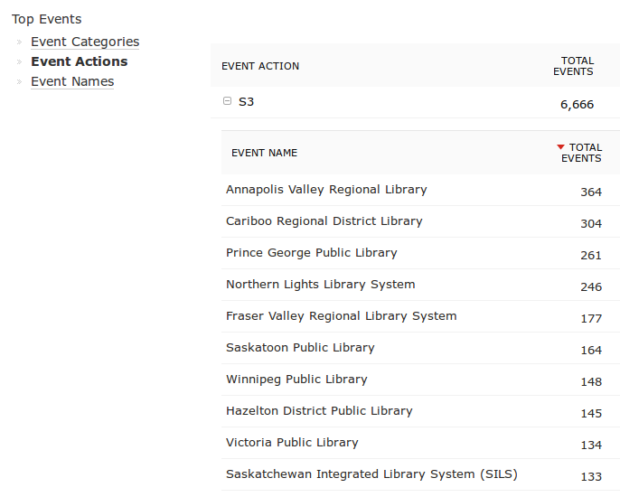
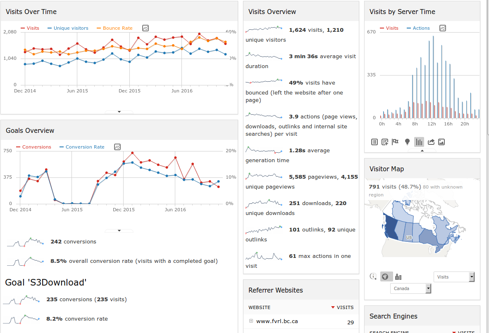
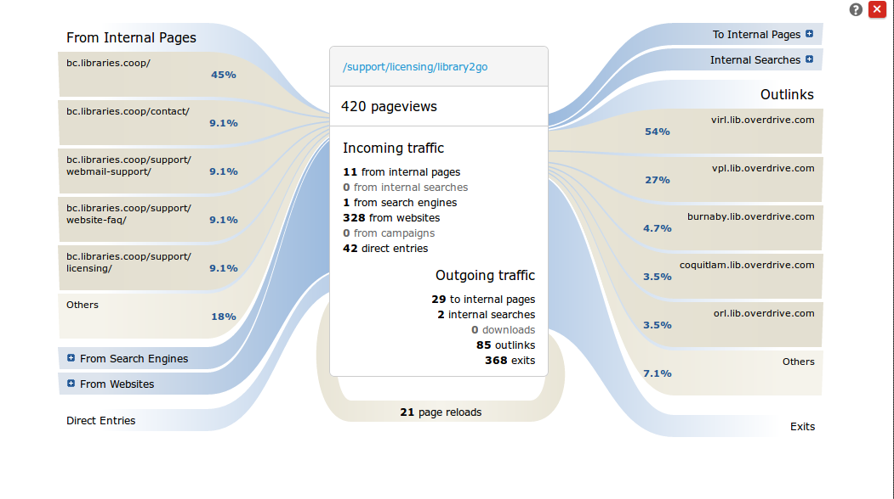
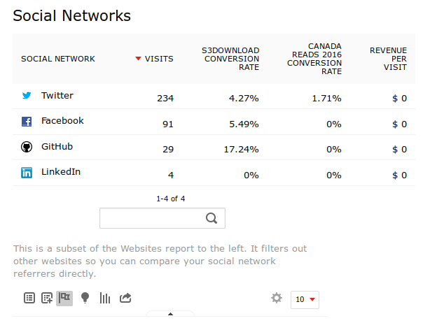

#VSLIDE


### Alternative Web Analytics

<span style="font-size: 0.6em; font-style: italic; float: right;">Schatz
<br>BC Libraries Cooperative</span>

#VSLIDE


#HSLIDE
## About the project
- Self-host or Piwik Cloud
- LAMP stack
- FOSS, modules
- Privacy focus

#HSLIDE
### Privacy virtues
- Self-hosted -> data control
- PII/SPI friendly defaults
- Honours DoNotTrack

#HSLIDE
## Maximize Privacy
##### by...minimizing data collected
1. Anonymize IPs 
<br> e.g. 208.55.xxx.xxx
<br>
2. Set retention period:
  * raw logs
  * archived reports
  <br>
3. Offer opt-out
4. TLS

#HSLIDE
## Standard Metrics
Visits (Sessions), Pageviews<br>
Bounce Rate
<br>
Visit & Action (views, events) scopes ,
<br>
Custom Dimensions for reports and segments

#VSLIDE
Simple custom variable tally


#HSLIDE
## Dashboard
Pare down to basic wigets + customize



#HSLIDE
## Transition


#HSLIDE
## Custom metrics
<br>
###Calls tracker from:
* Admin UI (regex)
* Query string param (http)
* Client-side API (js)
* Server-side (php)

#HSLIDE
###_gaq to _paq
```JavaScript
$(".views-field-field-s3-file-upload").click(function() {
	_paq.push(['setCustomDimension', 1, 'dimensionValue']);
});
```

#HSLIDE
## Goals /Conversions
### 'outcome conditions'
* Session -> downloaded more than 3 items
* Session -> watched tutorial
* Referred by email -> bookmarked items for later

#HSLIDE
## Metric x Goal


#HSLIDE
## Data quality
Referrer spam
vs Piwik's community spamlist
<br>Does GA even care?

#VSLIDE
(No.)

#HSLIDE
##Overall
1. Strong Privacy
2. Mix of Metrics
3. Some config
4. Graphs meh

